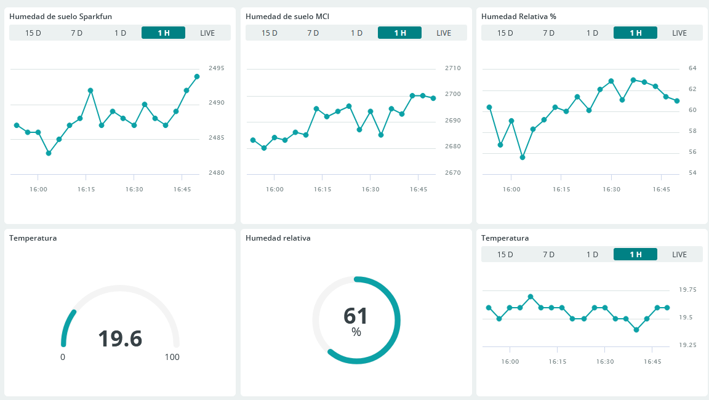

# smart_hydroponics
ArduinoIotCloud example for CD2201
## Dashboard Arduino IoT Cloud

## Arduino IoT Cloud: Thing

### Variables

- float dht22_hr;
- float dht22_temp
- String sensor_msg;
- int soil_mci;
- int soil_sparkfun;

## Components
- Arduino NANO ESP32
- DHT22
- 2x Relay
- 2x Soil moisture sensors

## PCB design

## Requirements
- ArduinoIoTCloud
- DHT22
